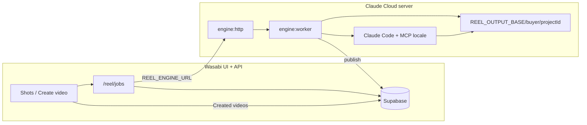

# Reel × Wasabi — guida operativa mediabuyer

> **Produzione video (default):** Claude Cloud host + Wasabi UI — **niente MCP sul laptop del mediabuyer**.  
> Setup host: [`ENGINE-HOST.md`](ENGINE-HOST.md) · script: `../scripts/setup-reel-engine-host.sh`.  
> MCP locale resta solo fallback ops / debug.

## Architettura (produzione)



| Chi | Cosa fa |
|---|---|
| **Mediabuyer** | Solo Wasabi: clean shots → **Create video on engine** (+ brief) → **Created videos** |
| **Host Claude Cloud** | Import footage, Claude director, render, publish |
| **MCP** | Solo sul host per Claude — **mai** esposto in UI |

Env Netlify: `REEL_ENGINE_URL`, `REEL_ENGINE_SECRET` (stesso secret del host).

---

## 1. Prerequisiti

| Tool | Note |
|---|---|
| Node.js **≥ 20** | `node -v` |
| **pnpm** | `corepack enable` |
| **ffmpeg** + **ffprobe** | `brew install ffmpeg` |

---

## 2. Chiavi (`reel/.env`)

Copia da `reel/.env.example` (lo script setup lo crea se manca).

| Variabile | A cosa serve |
|---|---|
| `FAL_KEY` | Video scene (Kling / Seedance) |
| `ELEVENLABS_API_KEY`, `ELEVENLABS_VOICE_ID` | Voiceover |
| `GOOGLE_API_KEY` | Storyboard / vision |
| `NEXT_PUBLIC_SUPABASE_URL` | Stesso progetto Supabase di tool-wasabi |
| `SUPABASE_SERVICE_ROLE_KEY` | Import storage + publish (service role) |
| `REEL_OUTPUT_BASE` | Opzionale; default `~/Movies/reel-ai`. Per progetto Wasabi: `<base>/<projectId>/` |

---

## 3. MCP — Cursor

In root **tool-wasabi**, file `.mcp.json`:

```json
{
  "mcpServers": {
    "wasabi-reel": {
      "command": "pnpm",
      "args": ["exec", "tsx", "mcp/server.ts"],
      "cwd": "reel",
      "envFile": "reel/.env"
    }
  }
}
```

Il server carica anche esplicitamente `reel/.env` all’avvio (`override: false`).

**Cursor:** abilita MCP dal workspace `tool-wasabi` (Settings → MCP). Riavvia se i tool non compaiono.

Smoke test:

```bash
cd tool-wasabi/reel && pnpm mcp
# Ctrl+C per uscire
```

---

## 4. MCP — Claude Code

Equivalente manuale (dalla root `tool-wasabi`):

```bash
claude mcp add wasabi-reel -- \
  pnpm exec tsx mcp/server.ts
```

Oppure aggiungi al config JSON del progetto con `cwd: reel` e variabili da `reel/.env` (URL + service role + FAL + ElevenLabs + Google). **Non** committare `.env`.

Tool namespace: **wasabi-reel**.

| Tool | Uso |
|---|---|
| `reel_import_cleaned_shots` | Shot puliti + full cleaned ads → disco locale |
| `reel_validate_script` | Valida `script.json` |
| `reel_audio_only` / `reel_storyboard` / `reel_video_only` / `reel_render` | Pipeline a gate |
| `reel_status` | Artefatti in `reelDir` |
| `reel_publish_to_wasabi` | `final.mp4` → Supabase + `generated_videos` |

Skill consigliata: `.claude/skills/reel-director`.

---

## 5. Workflow numerato (mediabuyer)

1. **Setup una tantum:** `./scripts/setup-reel-mediabuyer.sh` + compila `reel/.env`.
2. **Wasabi UI:** apri progetto → **Competitor Library** → tab **Shots**.
3. **Footage:** split competitor video; **Remove subs with AI** dove serve (CLEANED).
4. **Reel panel:** controlla conteggi → **Prepare for Reel Engine** (inventory JSON su server).
5. **Copia `projectId`** (o prompt MCP dal pannello).
6. **Claude/Cursor + MCP:**
   - `reel_import_cleaned_shots` con `projectId`, `includeFullAds: true`
   - Skill **reel-director**: treatment → script → gate voce → storyboard → approve keyframes → video → render
   - `reel_status` su `reelDir` finché `finalMp4: true`
7. **Publish:** `reel_publish_to_wasabi` con `{ projectId, reelDir, brandId?, name? }`.
8. **Wasabi UI:** tab **Created videos** — stesso elenco dei video generati da build competitor.

Prompt tipo (copiabile dalla UI):

```text
Import cleaned reel footage for projectId <PROJECT_ID> (includeFullAds), then follow reel-director gates, then reel_publish_to_wasabi with the same projectId and final reelDir.
```

---

## 6. API publish (alternativa al MCP)

Per upload da browser o script senza path locale:

```http
POST /api/projecthub/projects/{projectId}/reel/publish
Content-Type: multipart/form-data

video=<file final.mp4>
thumb=<optional jpg>
brandId=123
name=my-reel
script=...
```

Richiede sessione progetto (come le altre API ProjectHub).

---

## 7. Troubleshooting

| Problema | Causa / fix |
|---|---|
| MCP senza tool / errori API | `reel/.env` incompleto; riavvia MCP. Verifica `FAL_KEY`, Supabase URL + service role. |
| Prepare OK ma import fallisce | Chiavi Supabase in `reel/.env`. Service role necessaria per download storage. |
| **501** su POST footage `download: true` da Netlify | Normale: il download locale funziona solo via **MCP** sulla macchina del mediabuyer. |
| Gate 4 / video bloccato | Keyframe non approvati: `reel_approve_keyframe` o marker `.approved`. |
| `final.mp4` missing al publish | Esegui `reel_render` dopo `--video-only`. Controlla `reel_status`. |
| Video non in UI | Controlla stesso `projectId`; refresh **Created videos**; verifica riga in `generated_videos`. |

---

## 8. Riferimenti

- Manuale pipeline dettagliato: `reel/CLAUDE.md`
- Skills: `reel-setup`, `reel-director`, `footage-montage` in `tool-wasabi/.claude/skills/`
